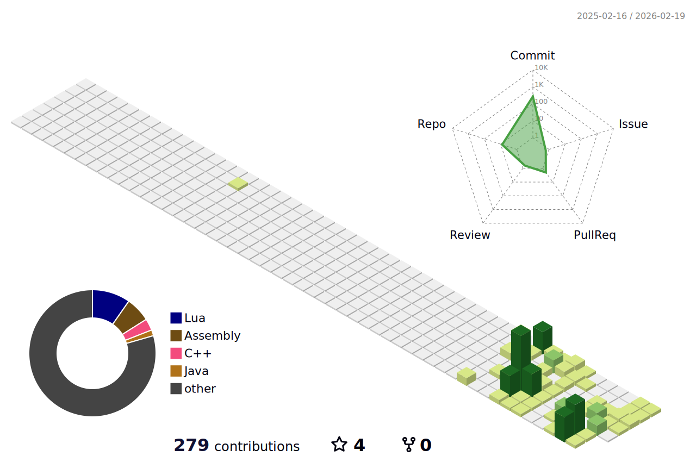

# 💫 About Me:  
Hey, I am Taco, a full-stack developer, game developer, Robotics Engineer, & OS Developer! 
I have been programming for 8 years and creating games for 9 years.
I love making games.
I am now exclusively using Roblox, and I create games for fun.       
I enjoy pushing code to its limits, and I love making tools to automate things!   
I love to collaborate with others and make projects, collaborating with my best friend [@sahleyis](https://github.com/sahleyis), working on Flux with me, and hopefully other projects in the future!
I am a Robotics Engineering Intern @Techmatics.
I love building things for myself or my friends!
Hoping to become the greatest programmer of all time one day, it is a lifelong goal. 

# ❗Warning
-What I post here isn't all of my work, just what I want to show to the public. 
-I really like to show stuff, but lots of my projects are just for small groups of my friends, so I like to keep them private, thank you! 
-Add Taco_Developz on Discord if you want to talk to me or collab with me, not working anymore unless it has incredible pay! 
                                                                                                                                                    
# 📝 What I hope to build in the future!
-My own website, similar to Scratch but with monetization ability! 
-My own custom computer, built with my OS (potentially), built for developers/programmers with built-in code editors, terminals, and strong cybersecurity! 

# 🔨 What I am currently working on:
-My own web browser (for my OS) ~ Started 31/01/26 (private project) 
-My own code editor ~ Started 18/02/25 (private project) 

# 📜 What I have currently made:
-This is a list of things I am willing to show! 
-A 3d [Gravity Simulation](https://github.com/NotTaco3/Gravity-Simulation) 
-My own Lua Framework [Flux](https://github.com/NotTaco3/Flux) w [@sahleyis](https://github.com/sahleyis) (not downloadable YET) 
-My own 2d Game Engine with Java. (only 2d (currently private)) 
-My own OS/Operating System, made with C, Rust, Assembly, and Go! Go *[here](https://github.com/tacodevelops/Stellar-Changelog)* to get more info and updates ~ 27/01/26 
-My own programming language, Lua# looks like Lua and compiles to JS, also has static typing! ~ 6/02/26 
-My own 3d Game Engine with C++ (only 3d (private project)) ~ 6/02/26 

# 🌱 I am currently learning:
-Fiber (Go framework, that boosts middleware support & integrates database systems) 
-More physics and programming simulations that are more realistic 
-Robotics @techmatics 
-Advanced Cyber Security 
-Advanced Machine Learning 

# 🧠 What I hope to learn in the future:
No idea, I have done many things & don't know what else I want/need to learn. 

# 🔗 Links
-My [Twitter](https://x.com/TacoDevelopz) 
-My Roblox [account](https://www.roblox.com/users/4709716031/profile) 
-Flux [website (info, updates, support, donations!)]()! < if your problems aren't solved here, please add @ taco_developz on Discord, and I can help you! 

# 💻 Tech Stack:

 
 
 
 
 
 
 
 

 
 
 
 
 
 
 
 
 
 
 
 
 
 
 
 
 
 
 
 
 
 
 
 
 
 
 
 
 
 
 
 
 
 

# 📊 GitHub Stats:

